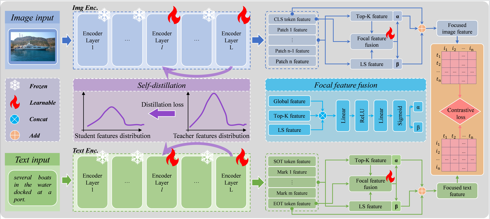

# F3SD

# Overview
We adopt CLIP containing dual-stream $L$ transformer layers to extract image and text features respectively. Firstly, we only open the last layer and an intermediate key layer, with all the other layers frozen. F$^{3}$-SD leverages the features of the last layer to distill the features of the intermediate layer. Secondly, based on the output features from self-distilled CLIP, we select key features including the global feature, Top-K feature and least similar (LS) feature. Next, we design Focal Feature Fusion (F$^{3}$) to adaptively fuse these key features, resulting in focused image and text features. Finally, we adopt the commonly used contrastive learning to train the image-text matching process.

# Setup

python >= 3.9

pip install torch==2.0.1 torchvision==0.15.2 torchaudio==2.0.2 --index-url https://download.pytorch.org/whl/cu118

pip install transformers sentence-transformers tqdm scikit-learn ftfy

# Task

## For COCO:
torchrun --nproc_per_node=2 --master-port 15160 retrieval.py --config "./configs/vitb32/coco/sd7_20.yaml"
torchrun --nproc_per_node=2 --master-port 15160 retrieval.py --config "./configs/vitb16/coco/sd7_20.yaml"
torchrun --nproc_per_node=2 --master-port 15160 retrieval.py --config "./configs/vitl14_336/coco/sd7_20.yaml"

## For Flick30k:
torchrun --nproc_per_node=2 --master-port 15160 retrieval.py --config "./configs/vitb32/flickr/sd7_20.yaml"
torchrun --nproc_per_node=2 --master-port 15160 retrieval.py --config "./configs/vitb16/flickr/sd7_20.yaml"
torchrun --nproc_per_node=2 --master-port 15160 retrieval.py --config "./configs/vitl14_336/flickr/sd7_20.yaml"
